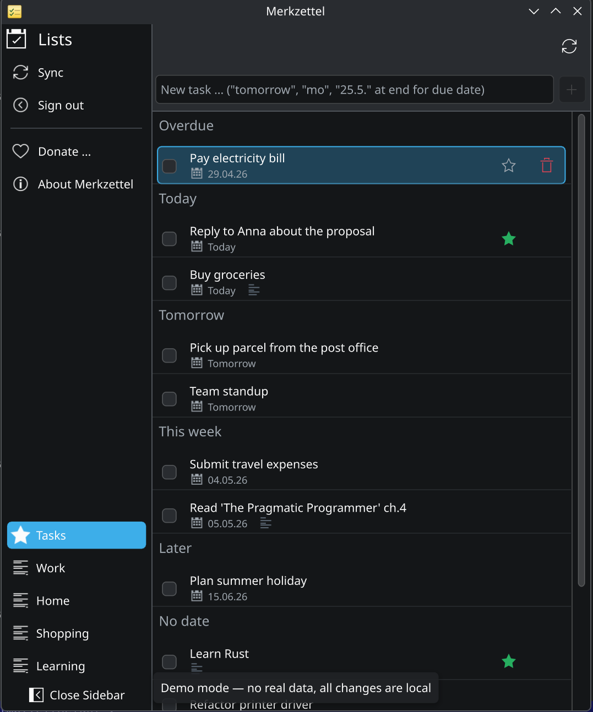
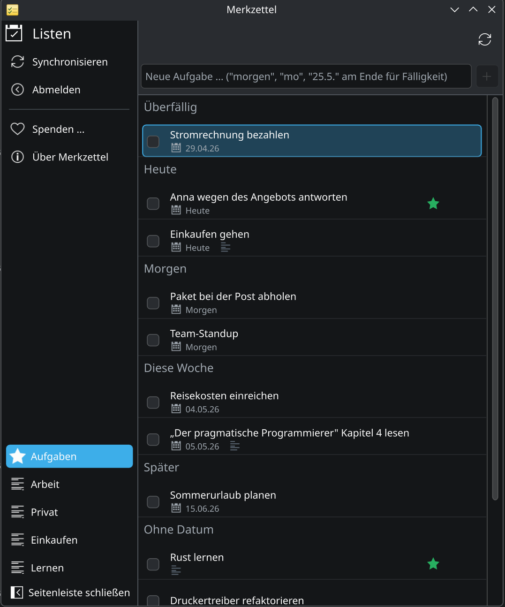

# Merkzettel

[](https://github.com/mzilinski/merkzettel/actions/workflows/build.yml)
[](LICENSES/GPL-3.0-or-later.txt)

Native KDE/Kirigami client for **Microsoft To Do**. Written in C++/Qt6, talks Microsoft Graph directly — no PWA, no web wrapper.

| English | Deutsch |
|:---:|:---:|
|  |  |

> Try it without an Azure account: `merkzettel --demo` runs the UI with built-in demo lists and tasks (no sign-in, no network, all mutations are no-ops). Both screenshots above were taken with `--demo`.

## Features

- OAuth2 sign-in via PKCE (public client, no secret embedded in the binary)
- Refresh token stored in **KWallet** (via QtKeychain)
- Lists and tasks fetched from Microsoft Graph
- Create, complete, delete tasks; importance (star), due date, reminder, notes
- Date+time picker via [kirigami-addons](https://invent.kde.org/libraries/kirigami-addons) `DatePopup`/`TimePopup`
- **Sectioned task view**: Overdue / Today / Tomorrow / This week / Later / No date / Completed
- Date parsing in the add bar: `Buy milk tomorrow`, `Pay rent mo`, `Doctor 25.5.`
- Right-click context menu, click-to-open detail sheet, hover-revealed star toggle
- **KStatusNotifierItem** tray icon with badge for tasks due today
- `--tray` flag for minimised startup (also exposed as a `.desktop` action)
- Closing the window minimises to tray instead of quitting
- SQLite cache for offline startup
- Plasma integration: Breeze theme, accent colour, dark mode, KDE about dialog
- i18n via KLocalizedString — English (source) + German translation included

## Install

### Dependencies (Arch / CachyOS)

```bash
sudo pacman -S \
  qt6-base qt6-declarative qt6-networkauth \
  kirigami kirigami-addons kcoreaddons ki18n knotifications \
  kstatusnotifieritem kconfig kconfigwidgets \
  qtkeychain-qt6 extra-cmake-modules cmake gettext
```

Other distros: equivalent KF6 packages (≥ 6.0) + Qt 6 (≥ 6.6) + qtkeychain.

### Build

1. Set up an Azure App Registration (see [`docs/azure-setup.md`](docs/azure-setup.md)).
2. Configure with your client ID and build:

```bash
cmake -B build -S . \
  -DMERKZETTEL_CLIENT_ID=<your-azure-client-id> \
  -DMERKZETTEL_TENANT=common \
  -DCMAKE_BUILD_TYPE=Release
cmake --build build -j
```

3. Run directly from the build directory (translations are picked up in-place):

```bash
./build/bin/merkzettel
```

4. Or install:

```bash
cmake --install build --prefix ~/.local
```

## Command-line flags

| Flag | Effect |
|---|---|
| `--tray`, `-t` | Start hidden in the system tray (clicking the tray icon shows the window) |
| `--demo` | Run with built-in demo data — no sign-in, no network, no persistence. Useful for screenshots or to evaluate the UI without setting up Azure |
| `--help` | Show all KAboutData options |

## Architecture

| File | Purpose |
|---|---|
| `src/main.cpp` | QApplication + KAboutData + QML engine setup |
| `src/app.{h,cpp}` | Top-level controller, exposed to QML as `app` |
| `src/auth/authmanager.{h,cpp}` | PKCE OAuth2 flow (QtNetworkAuth) |
| `src/auth/tokenstore.{h,cpp}` | Refresh-token storage in KWallet (QtKeychain) |
| `src/graph/graphclient.{h,cpp}` | HTTP wrapper, 401 → refresh → retry |
| `src/graph/todoapi.{h,cpp}` | To-Do endpoints: lists/tasks CRUD |
| `src/cache/database.{h,cpp}` | SQLite cache |
| `src/models/*.{h,cpp}` | `QAbstractListModel` for QML |
| `src/tray/trayicon.{h,cpp}` | KStatusNotifierItem |
| `src/Main.qml` | Application window + GlobalDrawer + DatePopup/TimePopup |
| `src/LoginPage.qml` | Sign-in page |
| `src/TasksPage.qml` | Task list with sections |
| `src/TaskDelegate.qml` | List delegate with star + context menu |
| `src/TaskDetailSheet.qml` | Detail editor (title, notes, date, reminder, importance) |
| `po/de/merkzettel.po` | German translation |

## Roadmap

**v0.3 — planned**
- Delta sync (`@odata.deltaLink`) instead of full refresh
- KNotifications for reminders (popup notifications)
- KGlobalAccel "Quick Add" global shortcut
- Subtasks (`checklistItems`)
- Multiple accounts

**v0.4 — ideas**
- Drag & drop between lists
- Recurring tasks (`recurrence`)
- Attachments + linked resources
- Plasmoid variant for direct panel access

## Contributing

Issues and PRs welcome. Conventions:

- All code, comments, commit messages and documentation in English
- User-facing strings in source code always wrapped in `i18n()`; translations live in `po/<lang>/merkzettel.po`
- Adding a language: create `po/<lang>/merkzettel.po`, the build picks it up automatically
- Run `cmake --build build` and verify the binary launches headlessly with `QT_QPA_PLATFORM=offscreen ./build/bin/merkzettel --demo` before opening a PR

## License

**GPL-3.0-or-later** — see [LICENSE](LICENSE) and [LICENSES/GPL-3.0-or-later.txt](LICENSES/GPL-3.0-or-later.txt). The repository follows [REUSE 3.0](https://reuse.software/).

## Donate

If Merkzettel is useful to you: <https://paypal.me/eit31> ❤
The underlying KDE/Qt stack is maintained by [KDE e.V.](https://kde.org/community/donations/).
